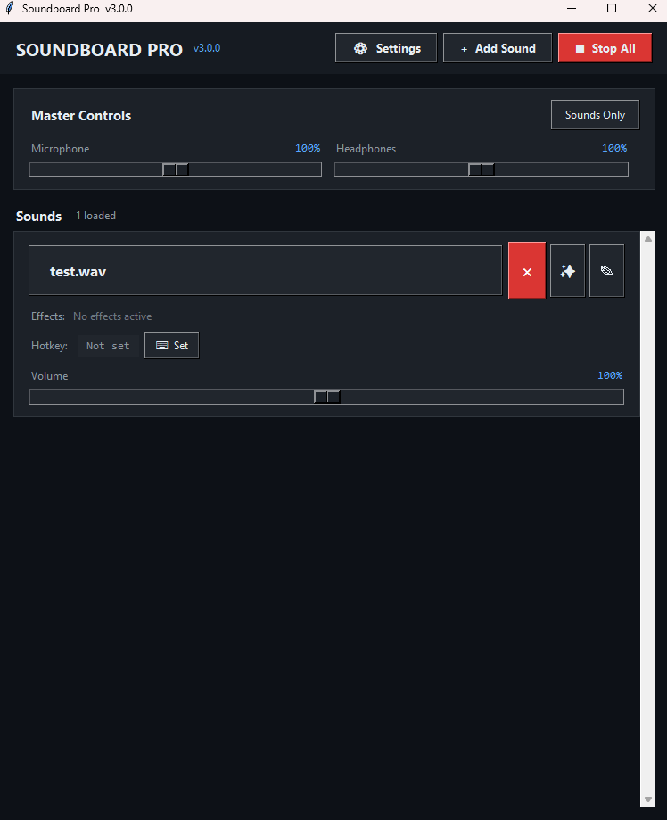
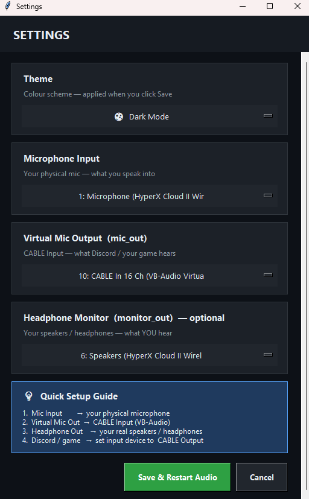

# 🎵 Soundboard Pro

Professional audio soundboard with global hotkeys for Windows and macOS.

## ✨ Features

- 🎮 **Global Hotkeys** - Works in games, Discord, anywhere
- 🎤 **Voice Passthrough** - Talk while sounds play
- 🎧 **Dual Audio** - Hear sounds in headphones + send to virtual mic
- 🎨 **Modern UI** - Sleek dark theme
- 💾 **Auto-Save** - All settings persist
- 🔄 **Auto-Update** - Get notified of new versions

## 📥 Download

### Windows
[Download Windows Installer](https://github.com/patrick-1480/soundboard-pro/releases/latest/download/SoundboardPro_Setup_v2.1.0.exe)

### macOS
[Download macOS DMG](https://github.com/patrick-1480/soundboard-pro/releases/latest/download/SoundboardPro_v2.1.0.dmg)

## 📋 Requirements

- **Windows:** 10 or 11 (64-bit)
- **macOS:** 10.15+ (Catalina or later)
- **VB-Audio Cable** (required): [Download here](https://vb-audio.com/Cable/)

## 🚀 Quick Start

1. Download installer for your OS
2. Install VB-Audio Cable
3. Run Soundboard Pro
4. Configure audio devices in Settings
5. Add sounds and set hotkeys!

## 📸 Screenshots

*Main interface with sound cards*

*Audio device configuration*

## 📖 Documentation

- [Installation Guide](docs/INSTALLATION.md)
- [User Guide](docs/USER_GUIDE.md)
- [Troubleshooting](docs/TROUBLESHOOTING.md)
- [Building from Source](docs/BUILDING.md)

## 🐛 Bug Reports

Found a bug? [Open an issue](https://github.com/patrick-1480/soundboard-pro/issues/new)

## 🤝 Contributing

Contributions welcome! See [CONTRIBUTING.md](CONTRIBUTING.md)

## 📄 License

MIT License - See [LICENSE](LICENSE.txt)

## 🙏 Acknowledgments

Built with:
- [Python](https://python.org)
- [sounddevice](https://python-sounddevice.readthedocs.io/)
- [librosa](https://librosa.org/)
- [keyboard](https://github.com/boppreh/keyboard)

---

Made with ❤️ by [patrick1480](https://github.com/patrick-1480)
