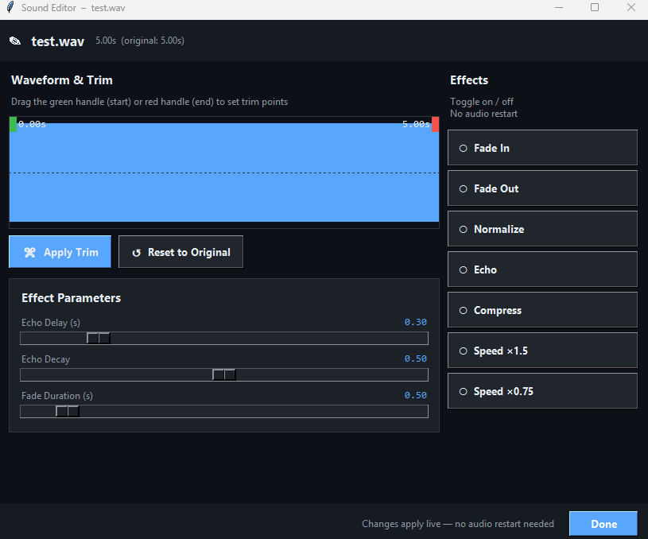

# 🎵 Soundboard Pro v3.0.0

Professional audio soundboard with global hotkeys, themes, and effects for Windows.

## ✨ Features

### 🎮 Core Features
- **Global Hotkeys** - Works in games, Discord, anywhere
- **Voice Passthrough** - Talk while sounds play
- **Dual Audio** - Hear sounds in headphones + send to virtual mic
- **Auto-Save** - All settings, volumes, and hotkeys persist
- **Auto-Update** - Get notified of new versions

### ⚡ Performance
- **Lightning Fast Startup** - Opens in <1 second (10x faster!)
- **Lazy Loading** - Heavy libraries load in background
- **Optimized Memory** - Efficient audio processing

### 🎨 Themes & Customization
- **3 Built-in Themes:**
  - 🌑 Dark Mode (default)
  - ☀️ Light Mode  
  - 💜 Purple Dream
- **Save Preferences** - Theme choice persists
- **Modern UI** - Sleek design with smooth animations

### 🎵 Audio Effects
- **Fade In/Out** - Smooth audio transitions
- **Normalize** - Balance audio levels
- **Echo** - Add depth and space
- **Speed Change** - Faster or slower playback
- **Compress** - Even out volume levels

### 📁 Workflow
- **Drag & Drop** - Drag MP3/WAV files directly onto app
- **Multi-File Import** - Import multiple sounds at once
- **Quick Access** - All sounds organized in one place

## 📸 Screenshots

### 🏠 Main Window

### ▶️ Using the Sounds Editor

### ⚙️ Settings Panel

## 📥 Download

**[Download Latest Release (v3.0.0)](https://github.com/patrick-1480/soundboard-pro/releases/latest)**

Download `SoundboardPro_Setup_v3.0.0.exe` and run the installer.

## 📋 Requirements

- **Windows 10 or 11** (64-bit)
- **VB-Audio Cable** (required): [Download here](https://vb-audio.com/Cable/)
- **Run as Administrator** for global hotkeys to work in games

## 🚀 Quick Start

1. Download and install VB-Audio Cable
2. Restart your computer (required after VB Cable install)
3. Download Soundboard Pro installer
4. Run `SoundboardPro_Setup_v3.0.0.exe`
5. Launch Soundboard Pro
6. Click **Settings** ⚙ and configure:
   - **Microphone Input:** Your physical microphone
   - **Virtual Mic Output:** CABLE Input
   - **Headphone Output:** Your speakers/headphones
7. Click "Apply & Restart Audio"
8. Drag MP3/WAV files onto the app or click **+ Add Sound**
9. Click sounds to play them or set hotkeys!

## 🎮 Discord/Game Setup

**In Discord (or your game):**
1. Go to Voice Settings
2. Set Input Device to **CABLE Output**
3. Your friends will now hear your sounds + voice!

## 🎨 Using Themes

1. Open **Settings** ⚙
2. Select theme from dropdown:
   - Dark Mode 🌑
   - Light Mode ☀️
   - Purple Dream 💜
3. Click "Apply"
4. Entire UI updates instantly!

## 🎵 Applying Effects

1. Find a sound card in the main window
2. Click the **✨ Effects** button
3. Choose an effect:
   - **Fade In** - Smooth start
   - **Fade Out** - Smooth end
   - **Normalize** - Balance volume
   - **Echo** - Add reverb
   - **Speed** - Change playback speed
   - **Compress** - Even out loud/quiet parts
4. Effect applies immediately!

## 📖 Features Guide

### Global Hotkeys
- Set a hotkey for each sound (F1, Ctrl+1, etc.)
- Works even when app is in background
- Works in games, Discord, anywhere
- **Note:** Run as Administrator for hotkeys in games

### Voice Passthrough
- Your voice and sounds are mixed together
- Both go to Discord/game simultaneously
- Adjust volumes independently

### Monitor Toggle
- **ON:** Hear yourself in headphones
- **OFF:** Only hear sounds, not your voice
- Your friends always hear you (toggle only affects what YOU hear)

### Volume Controls
- **Microphone:** How loud your voice is to others
- **Headphones:** How loud you hear everything
- **Per-Sound:** Individual volume for each sound

### Drag & Drop
- Drag MP3, WAV, OGG, or FLAC files onto the app window
- Files are automatically imported to your sounds folder
- No need to click buttons!

## 🐛 Troubleshooting

### "No audio devices found"
- Install VB-Audio Cable
- Restart your computer
- Open Settings and select devices

### Hotkeys don't work in games
- Right-click Soundboard Pro
- Run as Administrator
- Hotkeys should now work everywhere

### Sounds are too quiet/loud
- Adjust per-sound volume sliders
- Adjust master microphone volume
- Check Discord/game input sensitivity

### Settings don't save
- App saves to `%APPDATA%\SoundboardPro`
- Make sure folder isn't read-only
- Run as Administrator if needed

### App is slow to start
- v3.0.0 starts in <1 second with lazy loading
- If still slow, try reinstalling
- Make sure you have the latest version

## 🔄 Updating

The app checks for updates automatically on launch. When a new version is available:
1. Click "Yes" to download
2. Run the new installer
3. Your settings are preserved!

**Manual update check:**
- Click **Settings** ⚙
- Look for version info at bottom

## 🤝 Contributing

Contributions welcome! Feel free to:
- Report bugs in [Issues](https://github.com/patrick-1480/soundboard-pro/issues)
- Submit pull requests
- Suggest features

## 📄 License

MIT License - See [LICENSE](LICENSE.txt)

## 🙏 Acknowledgments

Built with:
- [Python](https://python.org)
- [sounddevice](https://python-sounddevice.readthedocs.io/)
- [librosa](https://librosa.org/)
- [keyboard](https://github.com/boppreh/keyboard)
- [scipy](https://scipy.org/)

## ❓ FAQ

**Q: Is this free?**
A: Yes! Completely free and open source.

**Q: Does it work on Mac/Linux?**
A: Currently Windows only.

**Q: Is it safe?**
A: Yes! All code is open source. Windows may show a warning because the app isn't code-signed (costs $300/year).

**Q: Can I use it for streaming?**
A: Absolutely! Works great with OBS, Streamlabs, etc.

**Q: How many sounds can I add?**
A: Unlimited! Limited only by your disk space.

**Q: Can I use .mp3 files?**
A: Yes! Supports .mp3, .wav, .ogg, and .flac

**Q: What's new in v3.0.0?**
A: 10x faster startup, theme system, drag & drop, audio effects, and much more!

## 📊 Changelog

### v3.0.0 (2025-02-08)
- ⚡ 10x faster startup with lazy loading
- 🎨 Theme system (Dark, Light, Purple)
- 📁 Drag & drop file import
- 🎵 Audio effects system
- 🔄 Auto-version management
- 🛡️ Dependency security updates
- 🎯 Improved UI/UX
- 🐛 Bug fixes and stability improvements

### v2.2.0
- Initial stable release
- Global hotkeys
- Voice passthrough
- Dual audio output

---

Made with ❤️ by [Patrick](https://github.com/patrick-1480)

⭐ Star this repo if you find it useful!
